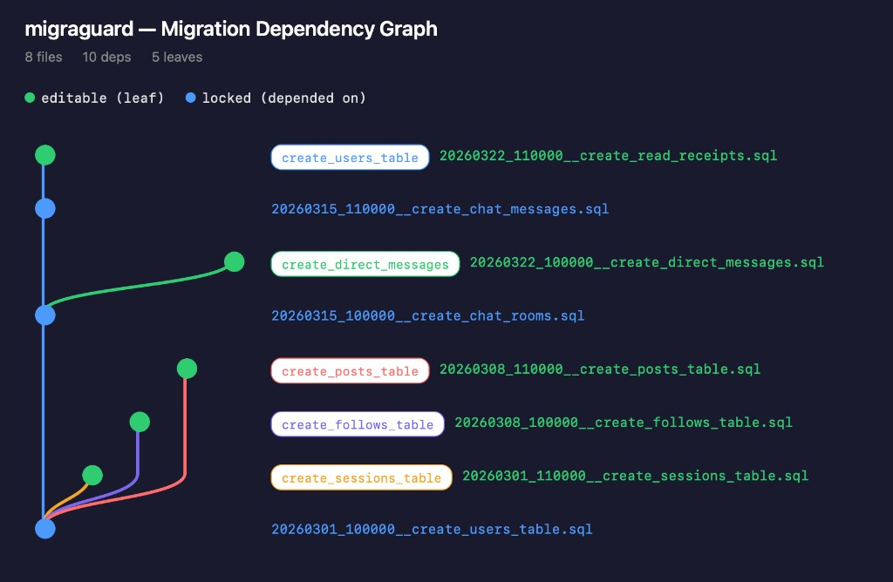

# migraguard

[](https://www.npmjs.com/package/migraguard) [](https://opensource.org/licenses/MIT)

An incident-prevention migration tool for PostgreSQL. Enforces safe operational policies via CI gates and DB state tracking, so that common migration accidents are structurally impossible.

**Prevented accidents:**

- **Past file tampering** — edits to applied migrations detected and rejected in CI (no DB required)
- **Hotfix reversion** — a fixed migration silently reverts to the old version via git revert, branch switch, or merge mistake
- **Silent failure suppression** — "just skip it and move on" without explicit human judgment
- **Concurrent apply race conditions** — parallel CI pipelines or manual executions collide
- **Schema drift** — unauthorized manual DDL diverges the DB from expected state

Execution is deliberately simple: plain SQL files executed via `psql`. migraguard focuses on **what to forbid**, not on providing a rich execution engine.

## Key Guarantees

- **Tamper detection in CI (offline)** — Only the tail file (linear) or leaf nodes (DAG) are editable. `check` rejects changes to any other file without DB connection
- **Regression detection** — If a hotfixed file reverts to an old checksum, `apply` raises an error immediately
- **Failure blocking with explicit resolve** — A `failed` migration blocks all progress until a human explicitly judges and resolves it
- **Drift gate + Idempotency proof** — two [verification mechanisms](#verification-two-distinct-mechanisms): `apply --with-drift-check` detects schema divergence before applying; `verify` proves migrations are safely re-executable on a shadow DB
- **Mutual exclusion** — `apply` uses PostgreSQL advisory locks to prevent concurrent execution
- **One release at a time** — the next migration cannot be added until the current release is deployed to all environments, ensuring the latest file is always hotfix-ready

## Quick Start

```bash
# Install
npm install --save-dev migraguard

# Create a new migration → edit the generated file → apply to local DB
npx migraguard new create_users_table
# → Created: db/migrations/20260301_120000__create_users_table.sql
# Edit the file shown above, then:
npx migraguard apply

# Before release: squash → lint + check → update dump
npx migraguard squash
npx migraguard lint && npx migraguard check
npx migraguard dump

# In PRs, CI runs lint + check (+ optionally verify)
```

## Design Philosophy

- **Plain SQL**: Migrations are SQL files executable via `psql -f`. No ORM or DSL; transaction boundaries are explicit in SQL
- **Forward-only**: Modifying applied migrations is prohibited by default; changes always build forward. Only the latest migration file may be overwritten and re-applied, assuming idempotency
- **One release = one file**: Migration files are squashed into a single file before release, simplifying error recovery. In DAG mode, independent DDL can be released individually
- **Parallel releases via dependency tree**: DDL dependencies are analyzed to build a DAG, enabling parallel releases for independent changes
- **Shift verification left**: Linting, checksum-based tamper detection, and schema dump diffs run at the PR stage
- **Minimal footprint**: Two CLI tools (`psql`, `pg_dump`) and one npm library ([libpg-query](https://github.com/pganalyze/libpg-query)). No external linter required — lint rules are built in via AST analysis

## Core Concepts

### Two-Layer State Management

migraguard separates file integrity and application state into two layers.

| Layer | Location | Role |
|-------|----------|------|
| **metadata.json** (repository) | `db/.migraguard/metadata.json` | File list and checksums. Used for CI integrity checks. Environment-independent |
| **schema_migrations** (per DB) | Each environment's PostgreSQL | Applied files and checksums per environment. Used by `apply` to determine pending migrations |

metadata.json represents "which files should exist"; schema_migrations represents "what has been applied." This separation enables correct staged rollout from a single repository to multiple environments (staging, production).

### Checksum Normalization

Checksums are computed on **normalized SQL** (SHA-256): comments are stripped (`-- ...` and `/* ... */` including nested), whitespace is collapsed, string literals are preserved as-is. Adding comments, adjusting indentation, or inserting blank lines does not change the checksum; only actual SQL statement changes are detected. `-- migraguard:depends-on` directives are also comments and do not affect the checksum.

### schema_migrations Table

```sql
CREATE TABLE IF NOT EXISTS schema_migrations (
    id          BIGSERIAL    PRIMARY KEY,
    file_name   VARCHAR(256) NOT NULL,
    checksum    VARCHAR(64)  NOT NULL,
    status      VARCHAR(16)  NOT NULL DEFAULT 'applied',  -- applied / failed / skipped
    applied_at  TIMESTAMPTZ  NOT NULL DEFAULT CURRENT_TIMESTAMP,
    resolved_at TIMESTAMPTZ                               -- resolution timestamp for skipped
);
```

Automatically created on the first run of `migraguard apply`.

The table is **fully INSERT-only** — no UPDATEs. Every application attempt (including failures) is recorded as a new row. This enables regression detection (matching the current checksum against all past checksums) and serves as a complete audit log. See [docs/state-model.md](docs/state-model.md) for design rationale and detailed behavior.

### Verification: Two Distinct Mechanisms

| Mechanism | Purpose | When to use |
|-----------|---------|-------------|
| `apply --with-drift-check` | **Drift gate**: detect unauthorized schema changes before apply, auto-update dump after | CI pipeline on merge to release branches |
| `verify` | **Idempotency proof**: apply migrations twice on a shadow DB, confirm no errors and no schema change | Before releases or in CI as a final safety net |

`apply --with-drift-check` guards against drift; `verify` proves re-executability. Both are stronger than lint rules — they operate on actual DB state. See [docs/state-model.md](docs/state-model.md) for detailed flows.

## Workflow

### Development → Release → Deploy

```
Development (feature branch):
  migraguard new add_user_email      → create migration file
  (edit SQL → migraguard apply)      → iterate on local DB (latest file is freely re-appliable)
  migraguard new add_email_index     → add more as needed
  (edit SQL → migraguard apply)

Release preparation:
  migraguard squash                  → merge into 1 file
  migraguard lint && check           → integrity + lint gate
  migraguard dump                    → update schema dump
  git commit

CI (PR):
  migraguard lint + check            → automated gate
  migraguard verify (optional)       → idempotency proof on shadow DB

Deploy:
  merge to db_dev → CI: apply --with-drift-check → staging
  merge to db_pro → CI: apply --with-drift-check → production
```

**Key rule**: Do not add the next migration file until the current release is deployed to all environments. This ensures the latest file can always be modified and re-applied for hotfixes.

### Environment State Transitions

A, B are previously applied migrations. S is the new migration created by squash for this release. Each column tracks which migrations are recorded in that layer:

| Stage | metadata.json | staging DB | production DB |
|-------|--------------|------------|---------------|
| Before release | A, B | A, B | A, B |
| After `squash` (commit S) | A, B, **S** | A, B | A, B |
| After deploy to staging | A, B, **S** | A, B, **S ✓** | A, B |
| After deploy to production | A, B, **S** | A, B, **S ✓** | A, B, **S ✓** |

Production deploy completes → all environments have S → the next migration can be added. Until then, S remains the only editable file, so hotfixes to S are always possible.

### Failure Recovery

- **Latest file (or leaf in DAG) fails**: Fix the file → re-run `apply`. The latest/leaf is always editable
- **Non-latest file fails**: Either `resolve` it (explicit skip, confirming a subsequent migration covers the fix) or `squash` it with a successor

See [docs/state-model.md](docs/state-model.md) for detailed apply, check, resolve, and squash flows.

## Commands

| Command | Description |
|---------|-------------|
| `new <name>` | Generate a new migration SQL file |
| `squash` | Merge pending files into one for release |
| `apply` | Execute pending migrations via `psql` |
| `apply --with-drift-check` | Drift check → apply → dump update |
| `resolve <file>` | Mark a failed migration as skipped (explicit judgment) |
| `status` | Display migration status per file |
| `editable` | List currently editable files (tail / leaf) |
| `check` | Verify file integrity via metadata.json (no DB required) |
| `lint` | Run built-in safety rules (AST-based) |
| `verify` / `verify --all` | Prove idempotency on shadow DB |
| `dump` | Save normalized schema dump |
| `diff` | Show schema diff (DB vs saved dump) |
| `deps` | Display dependency graph |
| `deps --html <path>` | Generate HTML dependency visualization |

See [COMMANDS.md](COMMANDS.md) for detailed usage, options, and examples.

## CI Integration

### PR Check

```yaml
name: DB Migration Check
on:
  pull_request:
    paths: ['db/**']

jobs:
  check:
    runs-on: ubuntu-latest
    steps:
      - uses: actions/checkout@v4
      - uses: actions/setup-node@v4
        with:
          node-version: '20'
      - run: npm ci
      - run: npx migraguard lint
      - run: npx migraguard check
```

### Automatic Apply on Merge

```yaml
name: Apply Migrations
on:
  push:
    branches: [db_dev]
    paths: ['db/migrations/**']

jobs:
  apply:
    runs-on: ubuntu-latest
    environment: dev
    steps:
      - uses: actions/checkout@v4
      - uses: actions/setup-node@v4
        with:
          node-version: '20'
      - run: npm ci
      - run: npx migraguard check
      - run: npx migraguard apply --with-drift-check
        env:
          PGHOST: ${{ secrets.DB_HOST }}
          PGDATABASE: ${{ secrets.DB_NAME }}
          PGUSER: ${{ secrets.DB_USER }}
          PGPASSWORD: ${{ secrets.DB_PASSWORD }}
```

## Configuration

```json
{
  "migrationsDirs": ["db/migrations"],
  "schemaFile": "db/schema.sql",
  "metadataFile": "db/.migraguard/metadata.json",
  "naming": {
    "pattern": "{timestamp}__{description}.sql",
    "timestamp": "YYYYMMDD_HHMMSS",
    "prefix": "",
    "sortKey": "timestamp"
  },
  "connection": {
    "host": "localhost",
    "port": 5432,
    "database": "myapp_dev",
    "user": "postgres"
  },
  "dump": {
    "normalize": true,
    "excludeOwners": true,
    "excludePrivileges": true
  },
  "lint": {
    "rules": {
      "require-concurrent-index": "error",
      "require-if-not-exists": "error",
      "require-lock-timeout": "error",
      "ban-drop-column": "warn",
      "ban-alter-column-type": "off"
    }
  }
}
```

### Naming Configuration

| Key | Default | Description |
|-----|---------|-------------|
| `pattern` | `{timestamp}__{description}.sql` | Filename template. Supports `{timestamp}`, `{prefix}`, `{description}` |
| `timestamp` | `YYYYMMDD_HHMMSS` | Timestamp format (local timezone). Use `NNNN` for serial number mode (auto-increments from max existing + 1) |
| `prefix` | `""` | Fixed prefix for category/service identification |
| `sortKey` | `timestamp` | Sort order key |

**Customization examples**:

```json
// Serial number based
{
  "naming": {
    "pattern": "{prefix}_{timestamp}__{description}.sql",
    "timestamp": "NNNN",
    "prefix": "billing"
  }
}
// → billing_0001__create_invoices_table.sql

// Prefix by microservice
{
  "naming": {
    "pattern": "{prefix}_{timestamp}__{description}.sql",
    "prefix": "auth"
  }
}
// → auth_20260301_120000__add_users_table.sql
```

`connection` can be overridden via environment variables (`PGHOST`, `PGPORT`, `PGDATABASE`, `PGUSER`, `PGPASSWORD`).

`migrationsDirs` accepts multiple paths for monorepo setups. `new` / `squash` write to the first directory. For backward compatibility, `migrationsDir` (singular) is also accepted.

```json
{
  "migrationsDirs": [
    "db/migrations",
    "services/auth/migrations",
    "services/billing/migrations"
  ]
}
```

## Migration File Conventions

Default pattern: `YYYYMMDD_HHMMSS__<description>.sql`

- Timestamps use local timezone
- Description: alphanumeric and underscores only
- Prefix operation type: `create_`, `add_`, `alter_`, `drop_`, `backfill_`, `create_index_`

Migration SQL must be idempotent — safe to re-execute after a partial failure:

```sql
CREATE TABLE IF NOT EXISTS users (...);
CREATE INDEX CONCURRENTLY IF NOT EXISTS idx_users_email ON users (email);
UPDATE users SET status = 'active' WHERE status IS NULL;
```

`migraguard lint` enforces these patterns with built-in rules (no external tools required):

| Rule | Detects |
|------|---------|
| `require-if-not-exists` | CREATE/DROP without IF NOT EXISTS / IF EXISTS |
| `require-concurrent-index` | CREATE INDEX without CONCURRENTLY on existing tables |
| `require-drop-index-concurrently` | DROP INDEX without CONCURRENTLY |
| `require-lock-timeout` | DDL without prior SET lock_timeout |
| `require-statement-timeout` | DDL without prior SET statement_timeout |
| `require-reset-timeouts` | SET lock/statement_timeout without RESET at end |
| `require-analyze-after-index` | CREATE INDEX without subsequent ANALYZE \<table\> |
| `require-create-or-replace-view` | CREATE VIEW without OR REPLACE |
| `require-unique-via-concurrent-index` | UNIQUE constraint added directly (not via USING INDEX) |
| `ban-concurrent-index-in-transaction` | CONCURRENTLY inside BEGIN...COMMIT |
| `ban-drop-cascade` | DROP ... CASCADE |
| `ban-truncate` | TRUNCATE |
| `ban-update-without-where` | UPDATE without WHERE |
| `ban-delete-without-where` | DELETE without WHERE |
| `ban-drop-column` | ALTER TABLE ... DROP COLUMN |
| `ban-alter-column-type` | ALTER TABLE ... ALTER COLUMN TYPE |
| `ban-validate-constraint-same-file` | VALIDATE CONSTRAINT in same file as NOT VALID |
| `ban-bare-analyze` | ANALYZE without table name |
| `adding-not-nullable-field` | NOT NULL column without DEFAULT |
| `constraint-missing-not-valid` | ADD CONSTRAINT (FK/CHECK) without NOT VALID |
| `require-if-not-exists-materialized-view` | CREATE MATERIALIZED VIEW without IF NOT EXISTS |
| `ban-refresh-materialized-view-in-migration` | REFRESH MATERIALIZED VIEW in migration files |

Each rule can be set to `"error"` (default — fail lint), `"warn"` (report but pass), or `"off"` (skip). Per-file exceptions use a comment directive:

```sql
-- migraguard:allow ban-drop-column, ban-alter-column-type
ALTER TABLE users DROP COLUMN legacy_field;
```

Project-specific rules can be added via `lint.customRulesDir`. See [docs/safe-ddl.md](docs/safe-ddl.md) for built-in rule details and custom rule examples.

## Directory Structure

```
project-root/
├── migraguard.config.json
├── db/
│   ├── migrations/
│   │   ├── 20260301_120000__create_users_table.sql
│   │   ├── 20260302_093000__add_email_index.sql
│   │   └── ...
│   ├── schema.sql             # Normalized schema dump (generated)
│   └── .migraguard/
│       └── metadata.json      # File list + checksums (no application state)
└── ...
```

## Linear vs DAG Model

The default linear model constrains "only the tail file can be modified." The DAG model relaxes this to "leaf nodes can be modified," enabling parallel work.

```
Linear:   A → B → C → [D]
                        ↑ only D is editable

DAG:        A
           / \
          B   C
          |     \
         [D]    [E]  ← both editable (leaf nodes)
                      D and E are independent — error in D does not block E
```



### When to Use DAG

Start with the linear model. Switch to DAG when:

- **Multiple teams modify independent tables concurrently** and serializing releases creates bottlenecks
- **Environment deploy lead time is long** (e.g., staging → production takes days), making the "deploy to all environments first" policy impractical
- **You want to localize failure blast radius** — in DAG mode, only dependents of a failed file are blocked
- **Independent schema changes should be releasable independently** (e.g., a new feature table should not wait for an unrelated index migration)

### How It Works

Each migration SQL is parsed into an AST via `libpg_query` to extract object creation/reference relationships and build the DAG. Auto-extraction covers `CREATE TABLE`, `ALTER TABLE`, `CREATE INDEX`, `CREATE VIEW`, and most standard DDL. For cases beyond auto-extraction (dynamic SQL, `DO` blocks, business-logic ordering), explicit dependency declarations are available:

```sql
-- migraguard:depends-on 20260228_120000__create_users_table.sql
```

See [docs/dag-internals.md](docs/dag-internals.md) for dependency analysis details, extraction scope, limitations, and the compatibility policy for migrating from linear to DAG.

## Comparison with Existing Tools

migraguard embeds operational policies into the tool and prevents incidents via CI gates, rather than providing a general-purpose migration execution engine.

| Axis | migraguard | [Flyway](https://flywaydb.org/) | [Atlas](https://atlasgo.io/) | [Sqitch](https://sqitch.org/) | [Graphile Migrate](https://github.com/graphile/migrate) |
|------|-----------|---------|-------|--------|------------------|
| **Tamper detection** | checksum + CI gate (offline) | checksum (at apply time) | Merkle hash (atlas.sum) | Merkle tree (sqitch.plan) | none |
| **Regression detection** | ✅ | ❌ | ❌ | ❌ | ❌ |
| **Drift detection** | ✅ apply --with-drift-check | ❌ | ✅ schema diff | ❌ | ⚠️ |
| **Idempotency verification** | ✅ verify (double-apply) | ❌ | ❌ | ❌ | ❌ |
| **Parallel releases** | ✅ DAG | ❌ | ❌ | ⚠️ | ❌ |
| **Offline CI gate** | ✅ check | ❌ | ✅ atlas.sum | ❌ | ❌ |
| **Failure handling** | DB-recorded, explicit resolve | repair overwrites | manual fix | revert scripts | manual fix |
| **Execution** | psql (plain SQL) | Java / JDBC | Go / DB driver | psql / sqitch | pg (Node.js) |

**vs Flyway / Liquibase**: migraguard adds offline CI tamper detection, regression detection, idempotency proof, and apply mutual exclusion. Trade-off: no multi-DB support, GUI, or rich execution engine.

**vs Atlas**: Atlas drives migration from a "desired state" declaration. migraguard focuses on preventing release-level operational incidents via explicit CI gates, plus parallel releases via DAG. Choose Atlas for declarative schema generation; choose migraguard for teams writing DDL directly with incident guardrails.

**vs Sqitch**: Sqitch supports dependency declarations, but migraguard packages a cohesive operational model on top: leaf-only editability, verify, regression detection, and failure blocking with explicit resolve.

**vs Graphile Migrate**: Graphile optimizes for development speed (current.sql). migraguard preserves iterative development (latest file is freely re-appliable) but adds "squash before release" for production-grade hotfix recovery.

## FAQ

### What happens if someone adds a comment to an already-applied migration?

Nothing. Checksums are computed on [normalized SQL](#checksum-normalization) — comments and whitespace are stripped before hashing.

### What happens if two CI pipelines run `apply` concurrently?

One acquires the advisory lock and proceeds; the other blocks until the first completes. No race condition occurs.

### A migration failed in production. How do I fix it?

If the failed file is the **latest** (or a leaf in DAG mode): fix the file and re-run `apply`.

If the failed file is **not the latest**: `resolve` it (confirming a subsequent migration covers the fix) or `squash` it with its successor.

### Someone accidentally reverted a hotfixed migration via git. Will migraguard catch it?

Yes. `apply` compares the current checksum against all past records. If it matches a non-latest past checksum, it raises a regression error.

### When should I switch from linear to DAG model?

See [When to Use DAG](#when-to-use-dag). In short: when multiple teams need parallel releases for independent schema changes, or when deploy lead times make the serial policy impractical.

### Does `verify` run against my production DB?

No. `verify` creates a temporary shadow DB, applies migrations twice, then drops it. Production is never modified.

## Technology Stack

| Component | Technology |
|-----------|-----------|
| Language | TypeScript (Node.js) |
| DB execution | `psql` CLI |
| Schema dump | `pg_dump --schema-only` |
| SQL lint | Built-in rules via [libpg-query](https://github.com/pganalyze/libpg-query) AST analysis |
| SQL parser | [libpg-query](https://github.com/pganalyze/libpg-query) (PostgreSQL real parser WASM build) |
| Package manager | npm |

## Detailed Documentation

- [COMMANDS.md](COMMANDS.md) — Full command reference with options and examples
- [docs/state-model.md](docs/state-model.md) — Apply/check/resolve/squash flows, INSERT-only design, regression detection
- [docs/dag-internals.md](docs/dag-internals.md) — Dependency analysis, explicit declarations, DAG migration compatibility
- [docs/safe-ddl.md](docs/safe-ddl.md) — Safe DDL patterns for PostgreSQL (lock timeout, CONCURRENTLY, batch backfills)
