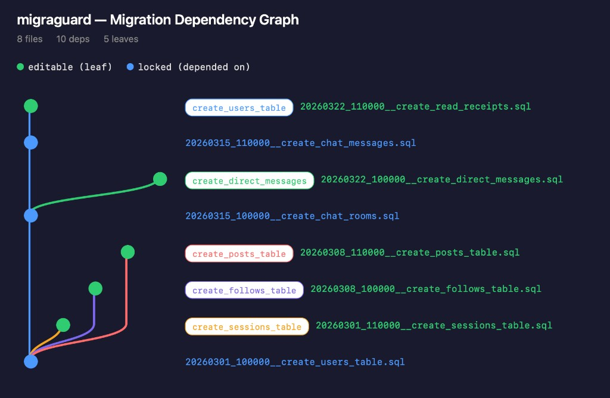

# migraguard

[](https://www.npmjs.com/package/migraguard) [](https://opensource.org/licenses/MIT)

PostgreSQL-first, schema-aware deployment control with built-in LLM agents. Generates production-safe migration SQL, audits operational risks, enforces the lint → apply → dump workflow, and explains command output — all from the CLI. Deterministic gates (38 AST-based lint rules, checksum tamper detection, schema drift detection, idempotency proof) run alongside LLM-powered semantic analysis, so domain expertise is encapsulated inside the tool rather than scattered across agent prompts.

MySQL and SQLite are supported as secondary dialects with 17 generic lint rules.

**What the LLM agents do:**

- **`implement`** — Describe a schema change in natural language; migration SQL files are written to the configured `migrationsDirs` with `CREATE INDEX CONCURRENTLY`, `ANALYZE`, `IF NOT EXISTS`, `lock_timeout`, `NOT VALID` + `VALIDATE` separation, and `UNIQUE USING INDEX` already applied
- **`audit`** — Semantic safety audit: lock risk under concurrent load, expand/contract necessity, backfill safety, deployment ordering, `migraguard:allow` directive validity
- **`audit-workflow`** — Verify the project follows the lint → apply → dump workflow, schema.sql is machine-generated, metadata.json is consistent, and expand/contract transitions are valid
- **`propose-expand-contract`** — Decompose unsafe DDL into phased expand/backfill/switch/contract SQL with deployment gates
- **`explain`** — Translate lint/diff/verify output into human-readable explanations for PR comments or release decisions

**What the deterministic gates prevent:**

- **Past file tampering** — edits to applied migrations detected and rejected in CI (no DB required)
- **Hotfix reversion** — a fixed migration silently reverts to the old version via git revert, branch switch, or merge mistake
- **Silent failure suppression** — "just skip it and move on" without explicit human judgment
- **Concurrent apply race conditions** — parallel CI pipelines or manual executions collide
- **Schema drift** — unauthorized manual DDL diverges the DB from expected state

Execution is deliberately simple: plain SQL files executed via the database's native CLI (`psql`, `mysql`, or `sqlite3`). migraguard focuses on **what to forbid**, not on providing a rich execution engine.

## Key Guarantees

- **Tamper detection in CI (offline)** — Only the tail file (linear) or leaf nodes (DAG) are editable. `check` rejects changes to any other file without DB connection
- **Regression detection** — If a hotfixed file reverts to an old checksum, `apply` raises an error immediately
- **Failure blocking with explicit resolve** — A `failed` migration blocks all progress until a human explicitly judges and resolves it
- **Drift gate + Idempotency proof** — two [verification mechanisms](#verification-two-distinct-mechanisms): `apply --with-drift-check` detects local schema divergence before applying; `diff` verifies post-deploy schema consistency; `verify` proves migrations are safely re-executable on a shadow DB
- **Mutual exclusion** — `apply` uses advisory locks to prevent concurrent execution (PostgreSQL `pg_advisory_lock`, MySQL `GET_LOCK`, SQLite file-level locking)
- **One release at a time** — the next migration cannot be added until the current release is deployed to all environments, ensuring the latest file is always hotfix-ready

## Quick Start

```bash
# Install (PostgreSQL — no extra deps needed)
npm install --save-dev migraguard

# For MySQL, also install the driver:
npm install mysql2

# For SQLite, also install the driver:
npm install better-sqlite3

# Enable LLM features (optional — requires an API key for your chosen adapter)
npm install --save-dev agent-contracts-runtime
```

### Generate migration SQL from natural language

```bash
# Generate migration SQL — files are written to the configured migrationsDirs
npx migraguard implement "add email verification token to users table" --adapter claude
# → Created: db/migrations/20260530_120000__add_email_verification_token.sql

# Then follow the standard workflow
npx migraguard lint && npx migraguard apply && npx migraguard dump

# Preview the prompt without calling the LLM
npx migraguard implement "add email verification token to users table" --dry-run
```

### Traditional workflow

```bash
# Create a new migration → edit the generated file → apply to local DB
npx migraguard new create_users_table
npx migraguard apply

# Before release: squash → lint + check → update dump
npx migraguard squash
npx migraguard lint && npx migraguard check
npx migraguard dump

# LLM-powered safety audit
npx migraguard audit --adapter openai

# Audit workflow compliance
npx migraguard audit-workflow --adapter claude

# Explain lint output for a PR comment
npx migraguard lint --format json | npx migraguard explain --adapter openai
```

## Design Philosophy

- **Plain SQL**: Migrations are SQL files executable via the database's native CLI (`psql -f`, `mysql`, `sqlite3`). No ORM or DSL; transaction boundaries are explicit in SQL
- **Forward-only**: Modifying applied migrations is prohibited by default; changes always build forward. Only the latest migration file may be overwritten and re-applied, assuming idempotency
- **One release = one file**: Migration files are squashed into a single file before release, simplifying error recovery. In DAG mode, independent DDL can be released individually
- **Parallel releases via dependency tree**: DDL dependencies are analyzed to build a DAG, enabling parallel releases for independent changes
- **Shift verification left**: Linting, checksum-based tamper detection, and schema dump diffs run at the PR stage
- **Agent-native**: Domain-specific semantic reasoning is encapsulated inside the toolchain itself. Higher-level agents do not need to know every PostgreSQL lock rule or expand/contract pattern — they invoke migraguard and consume structured findings
- **Minimal footprint**: Two CLI tools (`psql`, `pg_dump`) and one npm library ([libpg-query](https://github.com/pganalyze/libpg-query)) for the primary PostgreSQL path. MySQL uses `mysql` + `mysqldump` CLIs + [mysql2](https://github.com/sidorares/node-mysql2) (optional peer dep); SQLite uses `sqlite3` CLI + [better-sqlite3](https://github.com/WiseLibs/better-sqlite3) (optional peer dep). No external linter required — lint rules are built in via AST analysis. MySQL/SQLite linting uses [node-sql-parser](https://github.com/taozhi8833998/node-sql-parser) as a parallel, feature-limited engine

## Dialect support

PostgreSQL remains the **primary, full-featured** target: `libpg-query` powers all built-in lint rules (38) and unchanged behavior when `dialect` is `postgresql` (default).

Setting `dialect` to `mysql` or `sqlite` switches the entire tool chain to the corresponding database engine. Lint coverage is limited to **17 generic rules** (vs 38 for PostgreSQL); PostgreSQL-specific semantics (e.g. CONCURRENTLY, advisory lock timeout rules) are not replicated. This mode is for teams that want migraguard’s file workflow and a subset of safety checks on non-PostgreSQL SQL, not parity with the PG toolchain.

| Concern | `postgresql` (default) | `mysql` | `sqlite` |
|---------|------------------------|---------|----------|
| Lint AST | libpg-query (38 rules) | node-sql-parser (17 rules) | node-sql-parser (17 rules) |
| `deps` / DAG extraction | ✅ | ✅ | ✅ |
| `apply` (SQL execution) | `psql` CLI | `mysql` CLI | `sqlite3 -bail` CLI |
| `dump` / `diff` (schema dump) | `pg_dump --schema-only` | `mysqldump --no-data` | `sqlite3 .schema` |
| `verify` (shadow DB) | CREATE/DROP DATABASE | CREATE/DROP DATABASE | File copy/delete |
| State management (`schema_migrations`) | `pg` npm | `mysql2` (optional peer dep) | `better-sqlite3` (optional peer dep) |
| Advisory locking | `pg_advisory_lock` | `GET_LOCK` / `RELEASE_LOCK` | File-level (built-in) |
| Environment variables | `PGHOST`, `PGPORT`, `PGDATABASE`, `PGUSER`, `PGPASSWORD` | `MYSQL_HOST`, `MYSQL_TCP_PORT`, `MYSQL_DATABASE`, `MYSQL_USER`, `MYSQL_PWD` | `SQLITE_DATABASE` |
| File-based commands (`check`, `new`, `squash`, `editable`, …) | ✅ | ✅ | ✅ |

Omitting `dialect` is equivalent to `"postgresql"` — existing projects require no config change.

## Core Concepts

### Two-Layer State Management

migraguard separates file integrity and application state into two layers.

| Layer | Location | Role |
|-------|----------|------|
| **metadata.json** (repository) | `db/.migraguard/metadata.json` | File list and checksums. Used for CI integrity checks. Environment-independent |
| **schema_migrations** (per DB) | Each environment's database | Applied files and checksums per environment. Used by `apply` to determine pending migrations |

metadata.json represents "which files should exist"; schema_migrations represents "what has been applied." This separation enables correct staged rollout from a single repository to multiple environments (staging, production).

### Source of Truth: migrations (SSoT) vs schema.sql

migraguard treats **migration SQL files** as the **Single Source of Truth (SSoT)** for schema evolution.
They capture not only the end state, but also the *intent, ordering, and operational safety tactics* required for production changes.

`schema.sql` is a **derived artifact**:
- Generated from a real database via `dump` (`pg_dump`, `mysqldump`, or `sqlite3 .schema`), and updated locally by `apply --with-drift-check`
- Used as an **expected-state snapshot** for drift detection (`diff`) and human review
- Not intended to be hand-edited or treated as the authoritative desired state

This design supports migraguard's incident-prevention model:
- Offline CI integrity checks (`check`) can reason about history and editability rules without a DB
- Regression detection can catch "hotfix reversion" back to a previous checksum
- Drift is treated as a deployment blocker unless explicitly resolved through the normal workflow

> If you prefer a "desired state" workflow where the schema definition itself is the SSoT and migrations are generated from it, consider tools like Atlas. migraguard is optimized for teams writing DDL directly with operational guardrails.

### Checksum Normalization

Checksums are computed on **normalized SQL** (SHA-256): comments are stripped (`-- ...` and `/* ... */` including nested), whitespace is collapsed, string literals are preserved as-is. Adding comments, adjusting indentation, or inserting blank lines does not change the checksum; only actual SQL statement changes are detected. `-- migraguard:depends-on` directives are also comments and do not affect the checksum.

### schema_migrations Table

The DDL varies by dialect. Below is the PostgreSQL version; MySQL uses `BIGINT AUTO_INCREMENT` / `TIMESTAMP(6)` / `ENGINE=InnoDB`, SQLite uses `INTEGER PRIMARY KEY AUTOINCREMENT` / `TEXT` columns / `datetime('now')`.

```sql
-- PostgreSQL
CREATE TABLE IF NOT EXISTS schema_migrations (
    id          BIGSERIAL    PRIMARY KEY,
    file_name   VARCHAR(256) NOT NULL,
    checksum    VARCHAR(64)  NOT NULL,
    status      VARCHAR(16)  NOT NULL DEFAULT 'applied',  -- applied / failed / skipped
    applied_at  TIMESTAMPTZ  NOT NULL DEFAULT CURRENT_TIMESTAMP,
    resolved_at TIMESTAMPTZ,                              -- resolution timestamp for skipped
    tag         VARCHAR(256)                              -- caller-supplied tag (e.g. commit hash, release tag)
);
```

Automatically created on the first run of `migraguard apply`.

The table is **fully INSERT-only** — no UPDATEs. Every application attempt (including failures) is recorded as a new row. This enables regression detection (matching the current checksum against all past checksums) and serves as a complete audit log. See [docs/state-model.md](docs/state-model.md) for design rationale and detailed behavior.

### Verification: Two Distinct Mechanisms

| Mechanism | Purpose | When to use |
|-----------|---------|-------------|
| `apply --with-drift-check` | **Local drift gate**: detect unauthorized schema changes before apply, auto-update dump after | Local development before commit |
| `diff` | **Post-deploy verification**: confirm DB schema matches expected `schema.sql` after apply | CI pipeline on merge to release branches (run after `apply`) |
| `verify` | **Idempotency proof**: apply migrations twice on a shadow DB, confirm no errors and no schema change | Before releases or in CI as a final safety net |

`apply --with-drift-check` guards against drift in local development; `diff` verifies schema consistency after deployment; `verify` proves re-executability. All are stronger than lint rules — they operate on actual DB state. See [docs/state-model.md](docs/state-model.md) for detailed flows.

## Workflow

### Development → Release → Deploy

```
Development (feature branch):
  migraguard new add_user_email      → create migration file
  (edit SQL → migraguard apply)      → iterate on local DB (latest file is freely re-appliable)
  migraguard new add_email_index     → add more as needed
  (edit SQL → migraguard apply)

Release preparation:
  migraguard squash                  → merge into 1 file
  migraguard lint && check           → integrity + lint gate
  migraguard dump                    → update schema dump
  git commit

CI (PR):
  migraguard lint + check            → automated gate
  migraguard verify (optional)       → idempotency proof on shadow DB

Deploy:
  merge to db_dev → CI: apply → diff → staging
  merge to db_pro → CI: apply → diff → production
```

**Key rule**: Do not add the next migration file until the current release is deployed to all environments. This ensures the latest file can always be modified and re-applied for hotfixes.

### Environment State Transitions

A, B are previously applied migrations. S is the new migration created by squash for this release. Each column tracks which migrations are recorded in that layer:

| Stage | metadata.json | staging DB | production DB |
|-------|--------------|------------|---------------|
| Before release | A, B | A, B | A, B |
| After `squash` (commit S) | A, B, **S** | A, B | A, B |
| After deploy to staging | A, B, **S** | A, B, **S ✓** | A, B |
| After deploy to production | A, B, **S** | A, B, **S ✓** | A, B, **S ✓** |

Production deploy completes → all environments have S → the next migration can be added. Until then, S remains the only editable file, so hotfixes to S are always possible.

### Failure Recovery

- **Latest file (or leaf in DAG) fails**: Fix the file → re-run `apply`. The latest/leaf is always editable
- **Non-latest file fails**: Either `resolve` it (explicit skip, confirming a subsequent migration covers the fix) or `squash` it with a successor

See [docs/state-model.md](docs/state-model.md) for detailed apply, check, resolve, and squash flows.

## Expand/Contract Pattern (Class B Migrations)

For long-running schema changes — column renames, type migrations, table splits — migraguard supports the **expand/contract pattern** as a first-class concept. A Migration Group is a directory containing phased SQL files (`expand` → `backfill` → `switch` → `contract`) with a dedicated state machine, deployment gate, and executor commands.

```bash
# Create a migration group
migraguard new --expand-contract rename_username_to_handle

# Check group state
migraguard group-status

# Deployment gate (CI/CD integration)
migraguard gate --require "group:rename_username_to_handle.expand_applied"
```

See [docs/expand-contract.md](docs/expand-contract.md) for the complete guide: file structure, state machine, CI/CD integration patterns, TypeScript API, and idempotency examples.

## Commands

### Deterministic Commands

| Command | Description |
|---------|-------------|
| `new <name>` | Generate a new migration SQL file |
| `new --expand-contract <name>` | Create an expand/contract migration group |
| `squash` | Merge pending files into one for release |
| `apply` | Execute pending migrations via native CLI (`psql` / `mysql` / `sqlite3`) |
| `apply --with-drift-check` | Local: drift check → apply → dump update |
| `apply --from-baseline` | Apply `schema.sql` baseline, then remaining migrations |
| `apply --dry-run` | Preview pending migrations without executing |
| `resolve <file>` | Mark a failed migration as skipped (explicit judgment) |
| `status` | Display migration status per file |
| `editable` | List currently editable files (tail / leaf) |
| `check` | Verify file integrity via metadata.json (no DB required) |
| `lint` | Run built-in safety rules (AST-based) |
| `verify` / `verify --all` | Prove idempotency on shadow DB |
| `dump` | Save normalized schema dump |
| `diff` | Show schema diff (DB vs saved dump) |
| `deps` | Display dependency graph |
| `deps --html <path>` | Generate HTML dependency visualization |
| `group-status [group]` | Show Migration Group phase states |
| `advance <group> <phase> <status>` | Record phase state transition (executor) |
| `apply-phase <group> <phase>` | Apply a specific phase via native CLI |
| `gate` | Evaluate deployment gate conditions |
| `baseline` | Squash applied migrations into `schema.sql` |

### LLM-Powered Commands

| Command | Description |
|---------|-------------|
| `implement <description>` | Generate production-safe migration SQL from natural language (auto-writes to migrationsDirs) |
| `audit [target]` | Semantic migration safety audit via LLM |
| `audit-workflow` | Audit migration workflow compliance (lint → apply → dump, schema.sql integrity, metadata consistency) |
| `propose-expand-contract <file>` | Generate expand/contract migration group proposal |
| `explain` | Explain command output in human-readable form (accepts JSON or text from `lint`, `check`, `diff`, `deps`, `verify` via stdin) |

LLM-powered commands are read-only by default. `implement` generates SQL but writes files only when `--output-dir` is specified. All commands return structured results (`AgentAuditResult` / `AgentFinding` shape) consumable by CI systems and higher-level workflow agents.

All LLM commands require `agent-contracts-runtime` (optional peer dependency) and an adapter key, and support `--dry-run` to inspect the prompt without calling the LLM.

```bash
# Generate migration SQL from natural language
npx migraguard implement "add email verification token to users table" --adapter claude

# Audit a migration for operational risks
npx migraguard audit db/migrations/20260510__add_user_status.sql --adapter openai

# Audit project workflow compliance
npx migraguard audit-workflow --adapter claude

# Propose expand/contract decomposition for unsafe DDL
npx migraguard propose-expand-contract db/migrations/20260510__rename_column.sql --adapter cursor

# Explain lint output for a PR comment
npx migraguard lint --format json | npx migraguard explain --adapter openai
```

All commands honor the `dialect` setting. See [Dialect support](#dialect-support) for per-dialect details.

See [docs/commands.md](docs/commands.md) for detailed usage, options, and examples.

## CI Integration

### PR Check

```yaml
name: DB Migration Check
on:
  pull_request:
    paths: ['db/**']

jobs:
  check:
    runs-on: ubuntu-latest
    steps:
      - uses: actions/checkout@v4
      - uses: actions/setup-node@v4
        with:
          node-version: '20'
      - run: npm ci
      - run: npx migraguard lint
      - run: npx migraguard check
      # Optional: LLM semantic audit (requires API key)
      # - run: npx migraguard audit --adapter openai --format json --fail-on error
      #   env:
      #     OPENAI_API_KEY: ${{ secrets.OPENAI_API_KEY }}
```

### Automatic Apply on Merge

```yaml
name: Apply Migrations
on:
  push:
    branches: [db_dev]
    paths: ['db/migrations/**']

jobs:
  apply:
    runs-on: ubuntu-latest
    environment: dev
    steps:
      - uses: actions/checkout@v4
      - uses: actions/setup-node@v4
        with:
          node-version: '20'
      - run: npm ci
      - run: npx migraguard check
      - run: npx migraguard apply
        env:
          PGHOST: ${{ secrets.DB_HOST }}
          PGDATABASE: ${{ secrets.DB_NAME }}
          PGUSER: ${{ secrets.DB_USER }}
          PGPASSWORD: ${{ secrets.DB_PASSWORD }}
      - run: npx migraguard diff
        env:
          PGHOST: ${{ secrets.DB_HOST }}
          PGDATABASE: ${{ secrets.DB_NAME }}
          PGUSER: ${{ secrets.DB_USER }}
          PGPASSWORD: ${{ secrets.DB_PASSWORD }}
```

## Configuration

```json
{
  "dialect": "postgresql",
  "model": "dag",
  "migrationsDirs": ["db/migrations"],
  "schemaFile": "db/schema.sql",
  "metadataFile": "db/.migraguard/metadata.json",
  "naming": {
    "pattern": "{timestamp}__{description}.sql",
    "timestamp": "YYYYMMDD_HHMMSS",
    "prefix": "",
    "sortKey": "timestamp"
  },
  "connection": {
    "host": "localhost",
    "port": 5432,
    "database": "myapp_dev",
    "user": "postgres"
  },
  "dump": {
    "normalize": true,
    "excludeOwners": true,
    "excludePrivileges": true
  },
  "lint": {
    "rules": {
      "require-concurrent-index": "error",
      "require-if-not-exists": "error",
      "require-lock-timeout": "error",
      "ban-drop-column": "warn",
      "ban-alter-column-type": "off"
    }
  }
}
```

**MySQL example** — connection defaults to `localhost:3306`:

```json
{
  "dialect": "mysql",
  "connection": {
    "host": "localhost",
    "port": 3306,
    "database": "myapp_dev",
    "user": "root"
  }
}
```

**SQLite example** — only `database` (file path) is needed:

```json
{
  "dialect": "sqlite",
  "connection": {
    "database": "./db/myapp_dev.sqlite3"
  }
}
```

### Model Configuration

| Key | Default | Description |
|-----|---------|-------------|
| `dialect` | `"postgresql"` | SQL dialect: `"postgresql"` (libpg-query, 38 rules, `psql`/`pg_dump`), `"mysql"` (node-sql-parser, 17 rules, `mysql`/`mysqldump`), or `"sqlite"` (node-sql-parser, 17 rules, `sqlite3`). Omitted means `"postgresql"` |
| `model` | _(unset = linear)_ | Set to `"dag"` to enable DAG mode. When set in config, takes precedence over `metadata.json` |

### Naming Configuration

| Key | Default | Description |
|-----|---------|-------------|
| `pattern` | `{timestamp}__{description}.sql` | Filename template. Supports `{timestamp}`, `{prefix}`, `{description}` |
| `timestamp` | `YYYYMMDD_HHMMSS` | Timestamp format (local timezone). Use `NNNN` for serial number mode (auto-increments from max existing + 1) |
| `prefix` | `""` | Fixed prefix for category/service identification |
| `sortKey` | `timestamp` | Sort order key |

**Customization examples**:

```json
// Serial number based
{
  "naming": {
    "pattern": "{prefix}_{timestamp}__{description}.sql",
    "timestamp": "NNNN",
    "prefix": "billing"
  }
}
// → billing_0001__create_invoices_table.sql

// Prefix by microservice
{
  "naming": {
    "pattern": "{prefix}_{timestamp}__{description}.sql",
    "prefix": "auth"
  }
}
// → auth_20260301_120000__add_users_table.sql
```

`connection` can be overridden via dialect-specific environment variables: PostgreSQL (`PGHOST`, `PGPORT`, `PGDATABASE`, `PGUSER`, `PGPASSWORD`), MySQL (`MYSQL_HOST`, `MYSQL_TCP_PORT`, `MYSQL_DATABASE`, `MYSQL_USER`, `MYSQL_PWD`), SQLite (`SQLITE_DATABASE`).

`migrationsDirs` accepts multiple paths for monorepo setups. `new` / `squash` write to the first directory. For backward compatibility, `migrationsDir` (singular) is also accepted.

```json
{
  "migrationsDirs": [
    "db/migrations",
    "services/auth/migrations",
    "services/billing/migrations"
  ]
}
```

## Migration File Conventions

Default pattern: `YYYYMMDD_HHMMSS__<description>.sql`

- Timestamps use local timezone
- Description: alphanumeric and underscores only
- Prefix operation type: `create_`, `add_`, `alter_`, `drop_`, `backfill_`, `create_index_`

Migration SQL must be idempotent — safe to re-execute after a partial failure:

```sql
CREATE TABLE IF NOT EXISTS users (...);
CREATE INDEX CONCURRENTLY IF NOT EXISTS idx_users_email ON users (email);
UPDATE users SET status = 'active' WHERE status IS NULL;
```

`migraguard lint` enforces these patterns with built-in rules (no external tools required). **Scope** indicates which `dialect` values run the rule: **Generic** — enforced for `mysql` and `sqlite` (17 rules total on the node-sql-parser path); also part of the full PostgreSQL ruleset when `dialect` is `postgresql`. **PostgreSQL** — only when `dialect` is `postgresql` (libpg-query).

| Rule | Scope | Detects |
|------|-------|---------|
| `require-if-not-exists` | Generic | CREATE/DROP without IF NOT EXISTS / IF EXISTS |
| `require-concurrent-index` | PostgreSQL | CREATE INDEX without CONCURRENTLY on existing tables |
| `require-drop-index-concurrently` | PostgreSQL | DROP INDEX without CONCURRENTLY |
| `require-lock-timeout` | PostgreSQL | DDL without prior SET lock_timeout |
| `require-statement-timeout` | PostgreSQL | DDL without prior SET statement_timeout |
| `require-reset-timeouts` | PostgreSQL | SET lock/statement_timeout without RESET at end |
| `require-analyze-after-index` | PostgreSQL | CREATE INDEX without subsequent ANALYZE \<table\> |
| `require-create-or-replace-view` | Generic | CREATE VIEW without OR REPLACE |
| `require-unique-via-concurrent-index` | PostgreSQL | UNIQUE constraint added directly (not via USING INDEX) |
| `ban-concurrent-index-in-transaction` | PostgreSQL | CONCURRENTLY inside BEGIN...COMMIT |
| `ban-drop-cascade` | Generic | DROP … CASCADE (generic engine: regex; parser does not model CASCADE) |
| `ban-truncate` | Generic | TRUNCATE |
| `ban-update-without-where` | Generic | UPDATE without WHERE |
| `ban-delete-without-where` | Generic | DELETE without WHERE |
| `ban-drop-column` | Generic | ALTER TABLE … DROP COLUMN |
| `ban-alter-column-type` | Generic | ALTER TABLE … ALTER COLUMN TYPE |
| `ban-validate-constraint-same-file` | PostgreSQL | VALIDATE CONSTRAINT in same file as NOT VALID |
| `ban-bare-analyze` | PostgreSQL | ANALYZE without table name |
| `adding-not-nullable-field` | Generic | NOT NULL column without DEFAULT |
| `constraint-missing-not-valid` | PostgreSQL | ADD CONSTRAINT (FK/CHECK) without NOT VALID |
| `ban-select-star-in-view` | Generic | SELECT * in VIEW / MATERIALIZED VIEW definitions |
| `require-if-not-exists-materialized-view` | PostgreSQL | CREATE MATERIALIZED VIEW without IF NOT EXISTS |
| `ban-refresh-materialized-view-in-migration` | PostgreSQL | REFRESH MATERIALIZED VIEW in migration files |
| `ban-rename-column` | Generic | ALTER TABLE … RENAME COLUMN |
| `ban-rename-table` | Generic | ALTER TABLE … RENAME TO |
| `ban-drop-table` | Generic | DROP TABLE |
| `require-pk-via-concurrent-index` | PostgreSQL | PRIMARY KEY added directly (not via USING INDEX) |
| `ban-set-not-null` | PostgreSQL | ALTER COLUMN … SET NOT NULL (use CHECK NOT VALID pattern) |
| `ban-alter-enum-in-transaction` | PostgreSQL | ALTER TYPE … ADD VALUE inside BEGIN…COMMIT |
| `ban-vacuum-full` | PostgreSQL | VACUUM FULL (table rewrite + ACCESS EXCLUSIVE lock) |
| `ban-cluster` | PostgreSQL | CLUSTER (table rewrite + ACCESS EXCLUSIVE lock) |
| `ban-reindex` | PostgreSQL | REINDEX (heavy locks — run as operational job) |
| `ban-alter-system` | PostgreSQL | ALTER SYSTEM (cluster-wide config change) |
| `ban-set-session-replication-role` | PostgreSQL | SET session_replication_role (disables triggers/FK) |
| `expand-requires-idempotent-pattern` | Generic | CREATE without IF NOT EXISTS in expand phase *(expand only)* |
| `backfill-requires-where-clause` | Generic | UPDATE/DELETE without WHERE in backfill phase *(backfill only)* |
| `backfill-ban-ddl` | Generic | DDL statements in backfill phase *(backfill only)* |
| `contract-requires-allow-directive` | Generic | DROP without migraguard:allow in contract phase *(contract only)* |

Each rule can be set to `"error"` (default — fail lint), `"warn"` (report but pass), or `"off"` (skip). Phase-specific rules (marked above) only activate for the corresponding expand/contract phase file. Per-file exceptions use a comment directive:

```sql
-- migraguard:allow ban-drop-column, ban-alter-column-type
ALTER TABLE users DROP COLUMN legacy_field;
```

Project-specific rules can be added via `lint.customRulesDir`. See [docs/safe-ddl.md](docs/safe-ddl.md) for built-in rule details and custom rule examples.

## Directory Structure

```
project-root/
├── migraguard.config.json
├── db/
│   ├── migrations/
│   │   ├── 20260301_120000__create_users_table.sql          ← Class A (single file)
│   │   ├── 20260302_093000__add_email_index.sql
│   │   ├── 20260315_100000__rename_username_to_handle/      ← Class B (directory)
│   │   │   ├── 1_expand.sql
│   │   │   ├── 2_backfill.sql
│   │   │   ├── 3_switch.sql
│   │   │   └── 4_contract.sql
│   │   └── ...
│   ├── schema.sql             # Normalized schema dump (generated)
│   └── .migraguard/
│       └── metadata.json      # File list + checksums (no application state)
└── ...
```

## Linear vs DAG Model

The default linear model constrains "only the tail file can be modified." The DAG model relaxes this to "leaf nodes can be modified," enabling parallel work.

```
Linear:   A → B → C → [D]
                        ↑ only D is editable

DAG:        A
           / \
          B   C
          |     \
         [D]    [E]  ← both editable (leaf nodes)
                      D and E are independent — error in D does not block E
```



### When to Use DAG

Start with the linear model. Switch to DAG when:

- **Multiple teams modify independent tables concurrently** and serializing releases creates bottlenecks
- **Environment deploy lead time is long** (e.g., staging → production takes days), making the "deploy to all environments first" policy impractical
- **You want to localize failure blast radius** — in DAG mode, only dependents of a failed file are blocked
- **Independent schema changes should be releasable independently** (e.g., a new feature table should not wait for an unrelated index migration)

### How It Works

Each migration SQL is parsed into an AST to extract object creation/reference relationships and build the DAG: **postgresql** uses `libpg-query`; **mysql** / **sqlite** use node-sql-parser. Auto-extraction covers `CREATE TABLE`, `ALTER TABLE`, `CREATE INDEX`, `CREATE VIEW`, and FK references (exact coverage differs by dialect). For cases beyond auto-extraction (dynamic SQL, `DO` blocks, business-logic ordering), explicit dependency declarations are available:

```sql
-- migraguard:depends-on 20260228_120000__create_users_table.sql
```

See [docs/dag-internals.md](docs/dag-internals.md) for dependency analysis details, extraction scope, limitations, and the compatibility policy for migrating from linear to DAG.

## Comparison with Existing Tools

migraguard embeds operational policies into the tool and prevents incidents via CI gates, rather than providing a general-purpose migration execution engine.

| Axis | migraguard | [Flyway](https://flywaydb.org/) | [Atlas](https://atlasgo.io/) | [Sqitch](https://sqitch.org/) | [Graphile Migrate](https://github.com/graphile/migrate) |
|------|-----------|---------|-------|--------|------------------|
| **Tamper detection** | checksum + CI gate (offline) | checksum (at apply time) | Merkle hash (atlas.sum) | Merkle tree (sqitch.plan) | none |
| **Regression detection** | ✅ | ❌ | ❌ | ❌ | ❌ |
| **Drift detection** | ✅ apply --with-drift-check (local) / diff (CI) | ❌ | ✅ schema diff | ❌ | ⚠️ |
| **Idempotency verification** | ✅ verify (double-apply) | ❌ | ❌ | ❌ | ❌ |
| **Parallel releases** | ✅ DAG | ❌ | ❌ | ⚠️ | ❌ |
| **Offline CI gate** | ✅ check | ❌ | ✅ atlas.sum | ❌ | ❌ |
| **Failure handling** | DB-recorded, explicit resolve | repair overwrites | manual fix | revert scripts | manual fix |
| **LLM agents** | ✅ implement, audit, audit-workflow, propose-expand-contract, explain | ❌ | ❌ | ❌ | ❌ |
| **Agent-readable contract** | ✅ cli-contract.yaml + DSL | ❌ | ❌ | ❌ | ❌ |
| **Execution** | psql / mysql / sqlite3 (plain SQL) | Java / JDBC | Go / DB driver | psql / sqitch | pg (Node.js) |

**vs Flyway / Liquibase**: migraguard adds offline CI tamper detection, regression detection, idempotency proof, and apply mutual exclusion. MySQL and SQLite are supported as secondary dialects with full DB runtime commands and 17 generic lint rules. No GUI or rich generic execution engine.

**vs Atlas**: Atlas drives migration from a "desired state" declaration. migraguard focuses on preventing release-level operational incidents via explicit CI gates, plus parallel releases via DAG. Choose Atlas for declarative schema generation; choose migraguard for teams writing DDL directly with incident guardrails.

**vs Sqitch**: Sqitch supports dependency declarations, but migraguard packages a cohesive operational model on top: leaf-only editability, verify, regression detection, and failure blocking with explicit resolve.

**vs Graphile Migrate**: Graphile optimizes for development speed (current.sql). migraguard preserves iterative development (latest file is freely re-appliable) but adds "squash before release" for production-grade hotfix recovery.

## Agent-Native Toolchain

migraguard is designed for development workflows where AI agents are first-class participants in implementation, validation, and operations.

In traditional developer tooling, toolchains perform deterministic operations such as parsing, linting, validation, and diffing. Semantic judgment is left to humans or to an external agent runtime. This does not scale well because the outer agent must learn and maintain every domain-specific rule about PostgreSQL lock behavior, expand/contract safety, backfill batching, and deployment ordering.

migraguard takes a different approach: it encapsulates domain-specific semantic reasoning inside the toolchain itself. In addition to deterministic checks, the toolchain runs LLM-based semantic audits, expand/contract proposals, and command output explanations — returning structured results that humans, CI systems, and AI agents consume in the same way.

### Deterministic checks first

Anything that can be validated mechanically is validated deterministically: AST-based lint rules (38 for PostgreSQL), checksum-based tamper detection, schema drift comparison, idempotency verification on shadow databases, and expand/contract phase enforcement.

### Semantic audit and code generation inside the toolchain

Domain-specific reasoning that is difficult to express as static rules is handled by LLM-based commands:

- **`implement`** — Generate production-safe migration SQL from natural language descriptions, applying all safe DDL patterns (`CREATE INDEX CONCURRENTLY`, `ANALYZE`, `IF NOT EXISTS`, `lock_timeout`/`statement_timeout`, `NOT VALID` + `VALIDATE` separation, `UNIQUE USING INDEX`) and predicting lint results
- **`audit`** — Lock risk assessment under concurrent load, expand/contract necessity, backfill safety (batching, timeouts, resumability), deployment ordering with application releases, validity of `migraguard:allow` directives
- **`audit-workflow`** — Verify the project follows the prescribed lint → apply → dump workflow, schema.sql is machine-generated by `migraguard dump`, metadata.json is consistent with migration files, and expand/contract transitions are valid
- **`propose-expand-contract`** — Decompose unsafe DDL into phased expand/backfill/switch/contract SQL with deployment gates
- **`explain`** — Translate machine output into human-readable explanations for PR comments and release decisions

### Structured findings

LLM output is not free-form text. Results conform to typed schemas such as `MigrationAuditResult`, `ExpandContractProposal`, and `ExplainResult`. Audit-style results are compatible with the common `AgentAuditResult` / `AgentFinding` shape so that higher-level workflow agents can aggregate findings across toolchains.

### Tool-owned domain knowledge

migraguard owns the rules and reasoning for database migration safety. Instead of embedding PostgreSQL-specific knowledge into a top-level agent prompt, domain expertise is encapsulated inside the tool. Higher-level agents only need to invoke the command and interpret the structured output.

### Agent-readable interface

Tool capabilities are described in machine-readable form via [cli-contract.yaml](cli-contract.yaml): artifacts read/written, side effects (`database_write`, `database_read`, `file_write`, `network`), risk levels, confirmation requirements, and output schemas.

### LLM Adapter Configuration

| Adapter | Default Model | Environment Variable |
|---------|---------------|---------------------|
| `cursor` | runtime default | `CURSOR_API_KEY` |
| `openai` | runtime default | `OPENAI_API_KEY` |
| `gemini` | runtime default | `GEMINI_API_KEY` |
| `claude` | runtime default | `ANTHROPIC_API_KEY` |
| `mock` | — | — |

Default models are defined by `agent-contracts-runtime` and may change between releases. Use `--model` to pin a specific model.

```bash
# Generate migration SQL — written to configured migrationsDirs
npx migraguard implement "add status column to orders" --adapter claude

# Semantic safety audit
npx migraguard audit --adapter openai --model gpt-4o

# Audit workflow compliance
npx migraguard audit-workflow --adapter claude

# Propose expand/contract decomposition
npx migraguard propose-expand-contract migration.sql --adapter cursor

# Explain lint output for a PR comment
npx migraguard lint --format json | npx migraguard explain --adapter openai

# Inspect the prompt without calling the LLM
npx migraguard implement "add status column" --dry-run
```

Install the runtime dependency to enable LLM features:

```bash
npm install agent-contracts-runtime
```

## FAQ

### What happens if someone adds a comment to an already-applied migration?

Nothing. Checksums are computed on [normalized SQL](#checksum-normalization) — comments and whitespace are stripped before hashing.

### What happens if two CI pipelines run `apply` concurrently?

One acquires the advisory lock and proceeds; the other blocks until the first completes. No race condition occurs. PostgreSQL uses `pg_advisory_lock`, MySQL uses `GET_LOCK`, and SQLite relies on file-level locking.

### A migration failed in production. How do I fix it?

If the failed file is the **latest** (or a leaf in DAG mode): fix the file and re-run `apply`.

If the failed file is **not the latest**: `resolve` it (confirming a subsequent migration covers the fix) or `squash` it with its successor.

### Someone accidentally reverted a hotfixed migration via git. Will migraguard catch it?

Yes. `apply` compares the current checksum against all past records. If it matches a non-latest past checksum, it raises a regression error.

### When should I switch from linear to DAG model?

See [When to Use DAG](#when-to-use-dag). In short: when multiple teams need parallel releases for independent schema changes, or when deploy lead times make the serial policy impractical.

### Does `verify` run against my production DB?

No. `verify` creates a temporary shadow DB, applies migrations twice, then drops it. Production is never modified. For PostgreSQL and MySQL, a temporary database is created/dropped; for SQLite, a temporary file copy is used.

## Technology Stack

| Component | Technology |
|-----------|-----------|
| Language | TypeScript (Node.js) |
| DB execution (PostgreSQL) | `psql` CLI |
| DB execution (MySQL) | `mysql` CLI |
| DB execution (SQLite) | `sqlite3` CLI |
| Schema dump | `pg_dump` / `mysqldump` / `sqlite3 .schema` |
| DB state management (PostgreSQL) | [pg](https://github.com/brianc/node-postgres) |
| DB state management (MySQL) | [mysql2](https://github.com/sidorares/node-mysql2) (optional peer dep) |
| DB state management (SQLite) | [better-sqlite3](https://github.com/WiseLibs/better-sqlite3) (optional peer dep) |
| SQL lint / parser (PostgreSQL) | [libpg-query](https://github.com/pganalyze/libpg-query) — 38 built-in rules |
| SQL lint / parser (MySQL, SQLite) | [node-sql-parser](https://github.com/taozhi8833998/node-sql-parser) — 17 generic rules |
| LLM integration | [agent-contracts-runtime](https://www.npmjs.com/package/agent-contracts-runtime) (optional peer dep) |
| Agent DSL | [agent-contracts](https://www.npmjs.com/package/agent-contracts) — agent/task/workflow definitions |
| CLI contract | [cli-contracts](https://www.npmjs.com/package/cli-contracts) — machine-readable interface spec |
| Package manager | npm |

## Detailed Documentation

- [docs/cli-reference.md](docs/cli-reference.md) — Generated CLI reference (commands, options, exit codes, AI agent policies)
- [cli-contract.yaml](cli-contract.yaml) — Machine-readable CLI contract ([CLI Contracts](https://www.npmjs.com/package/cli-contracts) format)
- [docs/commands.md](docs/commands.md) — Full command reference with options and examples
- [docs/state-model.md](docs/state-model.md) — Apply/check/resolve/squash flows, INSERT-only design, regression detection
- [docs/dag-internals.md](docs/dag-internals.md) — Dependency analysis, explicit declarations, DAG migration compatibility
- [docs/safe-ddl.md](docs/safe-ddl.md) — Safe DDL patterns for PostgreSQL (lock timeout, CONCURRENTLY, batch backfills)
- [docs/expand-contract.md](docs/expand-contract.md) — Expand/contract pattern: phased migrations, state machine, CI/CD deployment gate
- [docs/typescript-api.md](docs/typescript-api.md) — TypeScript programmatic API: all commands as typed async functions
- [dsl/](dsl/) — Agent DSL definitions (agent, tasks, workflows, handoff types, guardrails)
